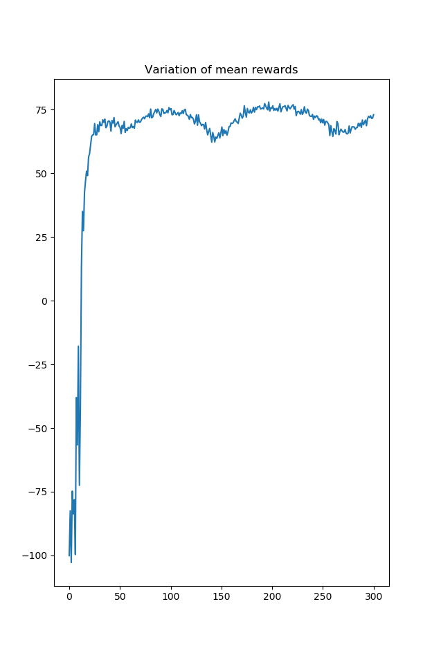
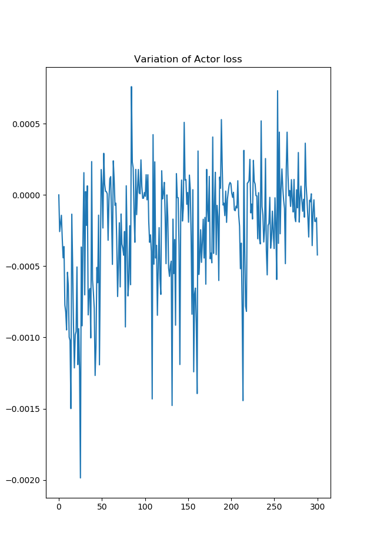
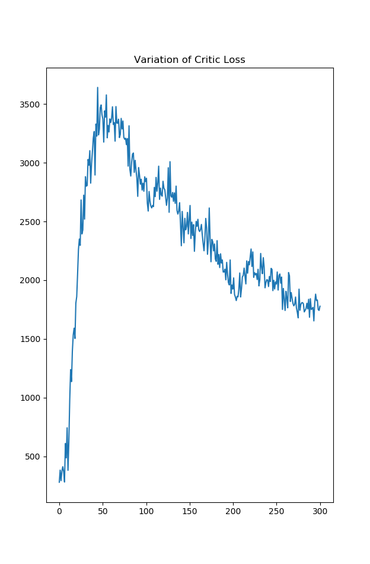

This is a Pytorch implementation of Proximal Policy Optimization as described in [this paper](https://arxiv.org/abs/1707.06347). 

The implementation used in [this repo](https://github.com/tpbarron/pytorch-ppo) was used as a reference for this implementation.

To run a demo, clone the repo and use the command:
``python simulate.py``

The training plots are shown below:

